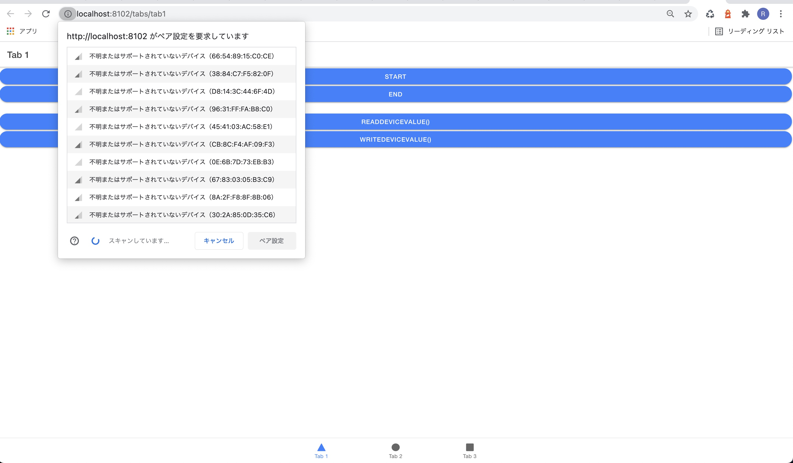
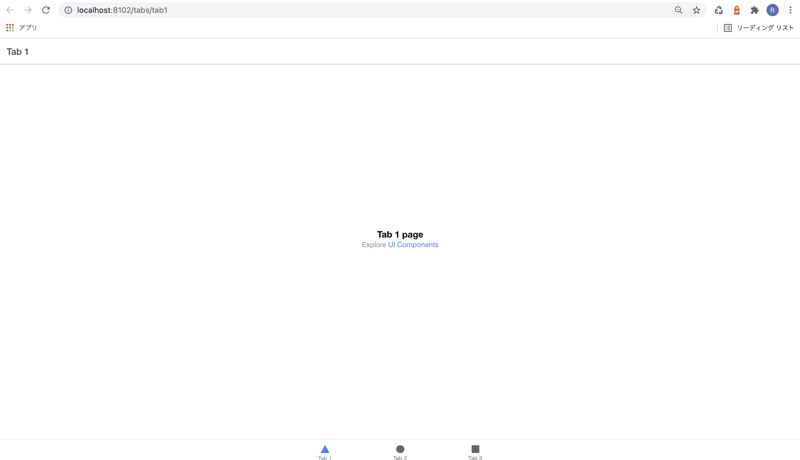

## 概要

このリポジトリはブラウザからBLEでラズパイとデータをやり取りする方法についてまとめた別記事のAngularでの実装部分について抜き出したリポジトリです．
ラズパイのBLEペリフェラルの立ち上げ方は[https://np-sys.com/ble-browser/](https://np-sys.com/ble-browser/)を参照してください．

## ゴール

AngularからBLEペリフェラルに接続できるようになります．



## 環境

```bash
 % ionic info

Ionic:

   Ionic CLI                     : 6.13.1 (/usr/local/lib/node_modules/@ionic/cli)
   Ionic Framework               : @ionic/angular 5.6.7
   @angular-devkit/build-angular : 0.1102.13
   @angular-devkit/schematics    : 11.2.13
   @angular/cli                  : 11.2.13
   @ionic/angular-toolkit        : 3.1.1

Utility:

   cordova-res                          : not installed
   native-run (update available: 1.3.0) : 1.0.0

System:

   NodeJS : v12.18.0 (/usr/local/bin/node)
   npm    : 6.14.6
   OS     : macOS Big Sur
```

## Projectを作成する

ionic startコマンドでプロジェクトを作成します．

[公式ドキュメント](https://ionicframework.com/docs/cli/commands/start)に従って下記のコマンドでTabsのテンプレートをAngularで作成します．

```bash
% ionic start sample-ble-app tabs --type=angular
% cd sample-ble-app/
```

プロジェクトが立ち上がることを確認します．

```bash
% ionic serve
```



## プラグインの追加

[https://github.com/NP-Systems/angular-ble](https://github.com/NP-Systems/angular-ble)を参考にインストールします．
本家の[https://github.com/NebulaEngineering/angular-ble](https://github.com/NebulaEngineering/angular-ble)はインストール方法が途中で終わっていたので修正しています，

```bash
npm install @nebulae/angular-ble
npm install @types/web-bluetooth
npm install aes-js
```

app.module.ts
```typescript
import { NgModule } from '@angular/core';
import { BrowserModule } from '@angular/platform-browser';
import { RouteReuseStrategy } from '@angular/router';

import { IonicModule, IonicRouteStrategy } from '@ionic/angular';

import { AppRoutingModule } from './app-routing.module';
import { AppComponent } from './app.component';

+import { AngularBleModule } from '@nebulae/angular-ble';

@NgModule({
  declarations: [AppComponent],
  entryComponents: [],
  imports: [
    BrowserModule, 
    IonicModule.forRoot(), 
    AppRoutingModule,
+    AngularBleModule.forRoot()
  ],
  providers: [{ provide: RouteReuseStrategy, useClass: IonicRouteStrategy }],
  bootstrap: [AppComponent],
})
export class AppModule {}
```


## 利用したいページでの追加

tab1.page.ts
```typescript
import { Component } from '@angular/core';
+import { BluetoothService } from '@nebulae/angular-ble';

@Component({
  selector: 'app-tab1',
  templateUrl: 'tab1.page.html',
  styleUrls: ['tab1.page.scss']
})
export class Tab1Page {

  constructor(
+    private bluetoothService: BluetoothService
  ) {}

+  //establish a connection between the browser and a bluetooth device
+  connectToDevice() {
+    console.log('connectToDevice() called');
+      this.bluetoothService.connectDevice$(
+      {
+      acceptAllDevices: true,
+      optionalServices:['0000fff0-0000-1000-8000-00805f9b34fb']
+      }
+      //{optionalServices:'123'}
+    ).subscribe(
+      res => {
+        console.log(res,'connected');
+      },
+      error => {
+        console.log('error');
+        console.log(error);
+        console.log(error.message);
+      },
+    ).add(() => {
+      console.log('finally done');
+    });
+  }


+  disconnectToDevice() {
+    this.bluetoothService.disconnectDevice();
+  }
  

+  readDeviceValue(){
+    //this.bluetoothService.readDeviceValue$('battery_service','battery_level').subscribe(result => {
+    this.bluetoothService.readDeviceValue$('0000fff0-0000-1000-8000-00805f9b34fb','0000fff1-0000-1000-8000-00805f9b34fb').subscribe(result => {
+      console.log('stream value22: ', result);
+      console.log('a');
+      console.log(typeof(result),'a2');
+      console.log(result['buffer']);
+      console.log(typeof(result['buffer']));
+      console.log(result['buffer'].toString());
+      console.log(new Int8Array(result['buffer']));
+      let data = new Int8Array(result['buffer'])
+      console.log(data,data[0]);
+      //var str = String.fromCharCode.apply(null, uint8Arr);
+      //console.log(String.fromCharCode.apply("", new Int8Array(result['buffer'])));
+      console.log(result['buffer'][1]);
+      console.log(result['buffer'][2]);
+      console.log(result['buffer'][3]);
+    });
+  }

+  writeDeviceValue(){
+    //this.bluetoothService.readDeviceValue$('battery_service','battery_level').subscribe(result => {
+    this.bluetoothService.writeDeviceValue$('0000fff0-0000-1000-8000-00805f9b34fb','0000fff1-0000-1000-8000-00805f9b34fb',this.uint32ToArrayBuffer(9)).subscribe(result => {
+      console.log('stream value22: ', result);
+      console.log('a');
+    });
+  }


+  uint32ToArrayBuffer(n) {
+    const view = new DataView(new ArrayBuffer(4));
+    view.setUint32(0, n, false);
+    return view.buffer;
+  }
    
}

```

tab1.page.html
```html
<ion-header [translucent]="true">
  <ion-toolbar>
    <ion-title>
      Tab 1
    </ion-title>
  </ion-toolbar>
</ion-header>

<ion-content [fullscreen]="true">

  <ion-button expand='block' (click)="connectToDevice()" shape='round'>Start</ion-button>
  <ion-button expand='block' (click)="disconnectToDevice()" shape='round'>End</ion-button>
  <br>
  <ion-button expand='block' (click)="readDeviceValue()" shape='round'>readDeviceValue()</ion-button>
  <ion-button expand='block' (click)="writeDeviceValue()" shape='round'>writeDeviceValue()</ion-button>
  {{batteryLevel}}
</ion-content>

```


このようになります．


## ライセンス

Copyright (c) 2021 NP-Systems Released under the MIT license https://opensource.org/licenses/mit-license.php